# Hill Sequence Labeling Tool - User Manual

## Table of Contents
1. [Introduction](#introduction)
2. [Getting Started](#getting-started)
3. [Step 1: Create a Project](#step-1-create-a-project)
4. [Step 2: Create a Template for Parsing](#step-2-create-a-template-for-parsing)
5. [Step 3: Create Event Classes](#step-3-create-event-classes)
6. [Step 4: Create a Folder](#step-4-create-a-folder)
7. [Step 5: Upload Files](#step-5-upload-files)
8. [Step 6: Open a File](#step-6-open-a-file)
9. [Step 7: Create Events (Labeling)](#step-7-create-events-labeling)
10. [Step 8: Navigate Between Files](#step-8-navigate-between-files)
11. [Advanced Features](#advanced-features)
12. [Keyboard Shortcuts](#keyboard-shortcuts)
13. [Tips and Best Practices](#tips-and-best-practices)

---

## Introduction

Hill Sequence is a time-series labeling tool designed for annotating temporal data from CSV and Excel files. It supports:
- Multi-channel time-series visualization
- Event labeling with customizable classes
- Guideline creation for threshold marking
- AI-powered auto-detection and chat assistance
- Team collaboration and sharing
- Large file handling (files up to several GB)

This manual will guide you through the complete workflow from project setup to data labeling.

---

## Getting Started

### System Requirements
- Modern web browser (Chrome, Firefox, Edge, Safari)
- Internet connection
- User account with login credentials

### Main Navigation
The application consists of the following main pages:
- **Folders**: Main dashboard for managing folders and organizing files
- **Files**: File list and upload interface within a folder
- **Labeling**: Interactive labeling interface for annotating time-series data
- **Projects**: Project and template configuration
- **Profile**: User settings and preferences

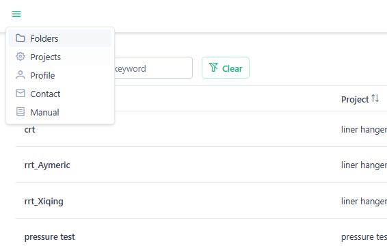

---

## Step 1: Create a Project

Projects are the top-level organizational units that contain event classes and templates.

### How to Create a Project

1. Navigate to the **Projects** page using the navigation menu
   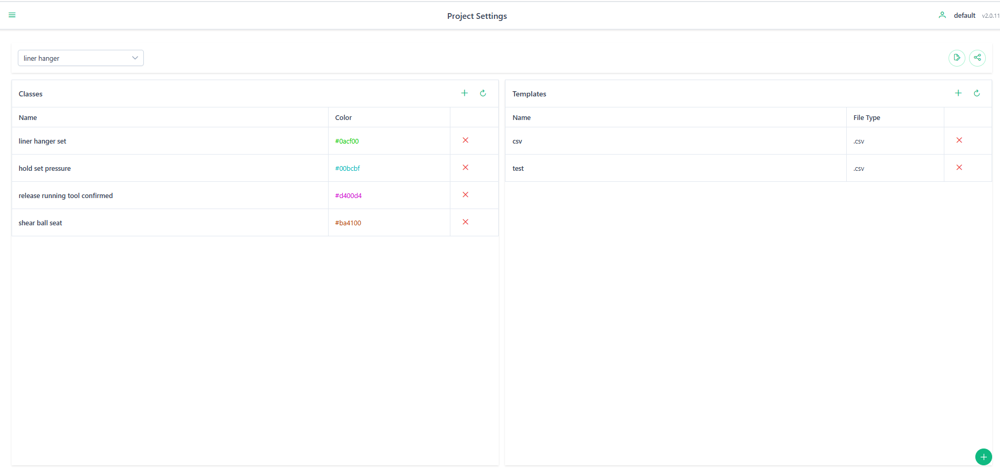

2. Click the **"Create New Project"** button (usually located at the top-right of the page)

3. In the dialog that appears, enter:
   - **Project Name**: A unique, descriptive name for your project
   - **Description** (optional): General information about the project

4. Click **"Create"** or **"Save"** to confirm

### Main Buttons on Projects Page
- **Create New Project**: Opens dialog to create a new project
- **Edit Project** (pencil icon): Modify project name and description
- **Delete Project** (trash icon): Remove project (with confirmation)
- **View/Manage Classes**: Navigate to event class management
- **View/Manage Templates**: Navigate to template management
- **Share Project**: Share with team members

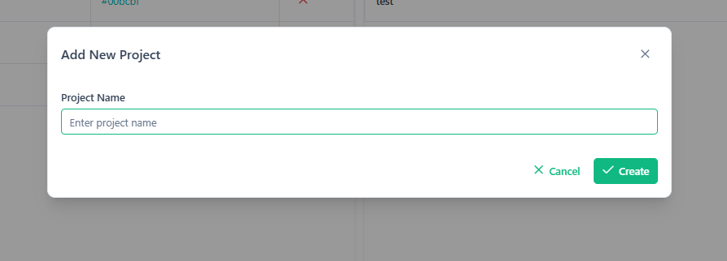

### After Creation
Once created, you can:
- Add event classes to the project
- Associate parsing templates
- Create folders that belong to this project

---

## Step 2: Create a Template for Parsing

Templates define how to parse CSV/Excel files into structured time-series data. Each template specifies:
- File type (CSV, Excel)
- X-axis configuration (time or numeric)
- Channel definitions (data columns to extract)

### How to Create a Template

1. From the **Projects** page, click **"Templates"** or navigate to the template management section

2. Click **"Create New Template"** button
   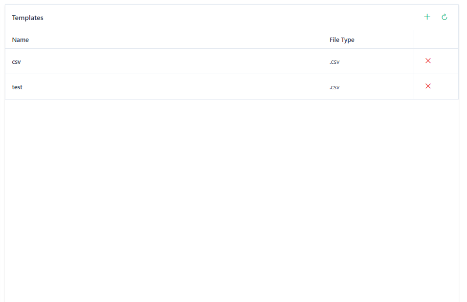

3. In the Template Editor dialog, configure the following:

#### Basic Settings
   - **Template Name**: Unique identifier for this template
   - **File Type**: Select from `.xlsx`, `.xls`, or `.csv`
   - **Sheet Name** (for Excel files): The name of the worksheet to parse
   - **Header Row**: Row number where column names are located
   - **Skip Rows**: Number of rows to skip before data starts

#### X-Axis Configuration
   - **X-Axis Name**: Column name for the time/index axis
   - **Use Row Index**: Toggle this if you want to use row numbers instead of a column
   - **Regex Pattern** (optional): Pattern to match the X-axis column name
   - **Is Time**: Check if X-axis contains timestamps
   - **Unit**: Specify the time unit (seconds, milliseconds, etc.) or numeric unit

#### Channel Configuration
   - **Add Channel**: Click to add each data channel (up to 8 channels)
   - For each channel, specify:
     - **Channel Name**: Identifier for this data series
     - **Regex Pattern**: Regular expression to match the column name in files
     - **Color**: Visualization color for this channel
     - **Mandatory**: Check if this channel must exist in all files
     - **Unit**: Measurement unit for this channel

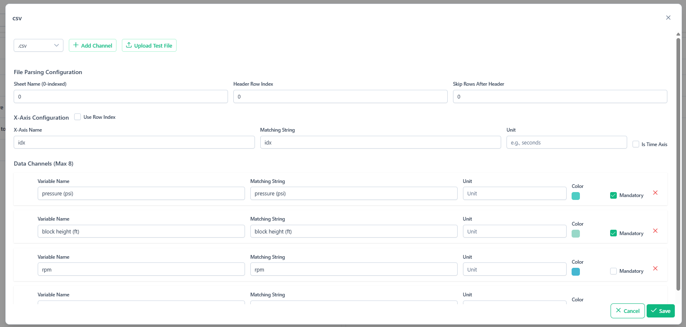

### Auto-Mapping Feature

To simplify template creation:

1. Click **"Upload Sample File"** in the template editor

2. Select a representative CSV/Excel file from your dataset

3. The system will automatically:
   - Extract all column names
   - Suggest X-axis column
   - Map columns to channels

4. Review and adjust the auto-mapped configuration as needed

5. Click **"Save Template"** to finalize

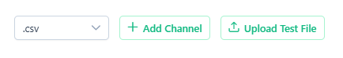

### Main Buttons in Template Editor
- **Upload Sample File**: Trigger auto-mapping from a sample file
- **Add Channel**: Add a new channel to the template
- **Remove Channel** (X icon): Delete a channel
- **Save Template**: Confirm and save the template
- **Cancel**: Close without saving

---

## Step 3: Create Event Classes

Event classes are the labels you'll apply to time ranges in your data (e.g., "Running", "Idle", "Error").

### How to Create Event Classes

1. From the **Projects** page, select your project
   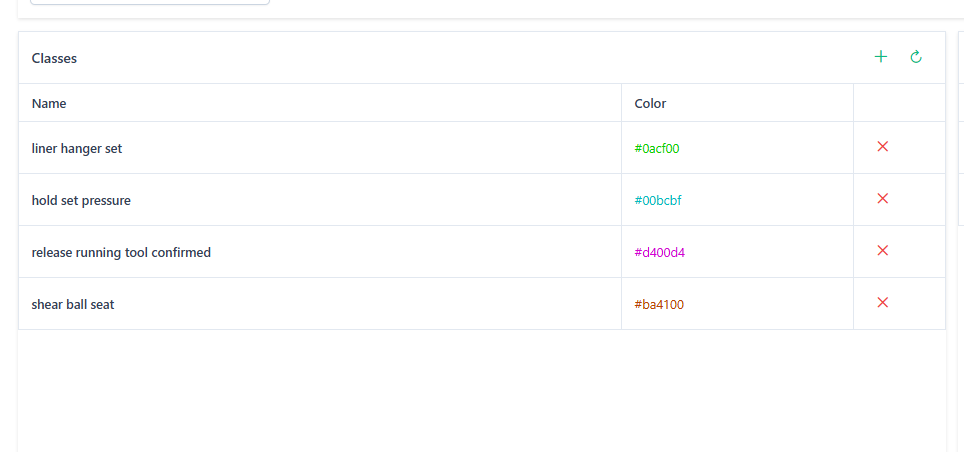

2. Click **"Add New Class"** button

3. In the class creation dialog, enter:
   - **Class Name**: The label name (e.g., "Normal Operation", "Fault")
   - **Color**: Choose a color for visualization (color picker)
   - **Description**: Detailed pattern description including:
     - Visual pattern characteristics
     - Measurement value changes
     - Duration ranges
     - Noise characteristics
     - Any distinguishing features

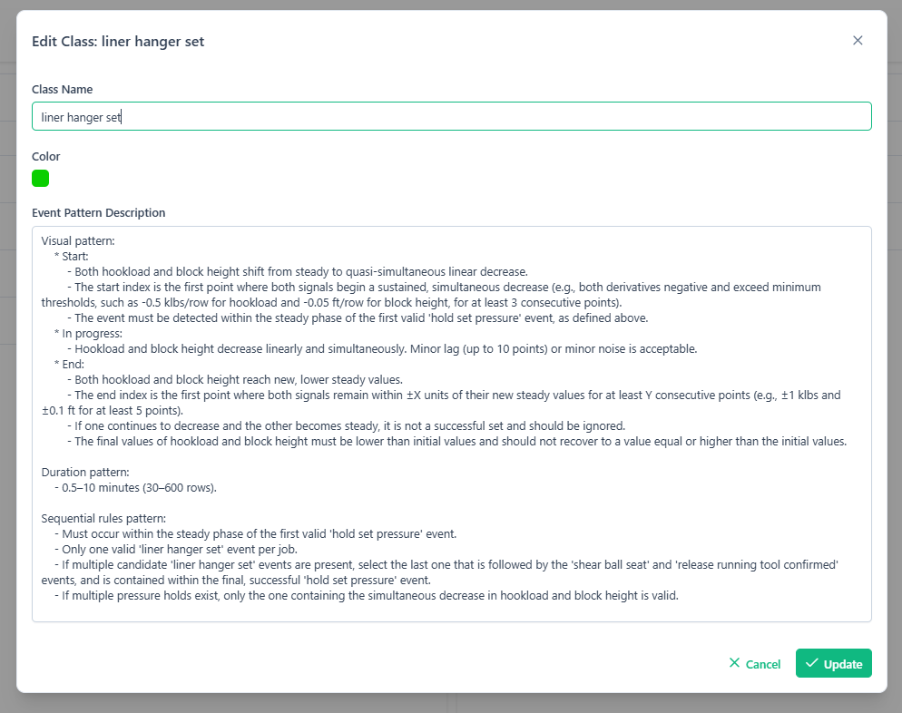

4. Click **"Save"** to add the class

### Editing Class Descriptions

You can edit class descriptions at any time:
- From the Projects page: Click edit icon next to a class
- From the Labeling page: Click **"Edit Class Descriptions"** in the toolbar

### Main Buttons on Event Classes Page
- **Add New Class**: Create a new event class
- **Edit Class** (pencil icon): Modify class name, color, or description
- **Delete Class** (trash icon): Remove a class
- **Reorder Classes**: Drag to change class order in lists

---

## Step 4: Create a Folder

Folders organize files within a project and link them to a specific template for parsing.

### How to Create a Folder

1. Navigate to the **Folders** page (main dashboard)
   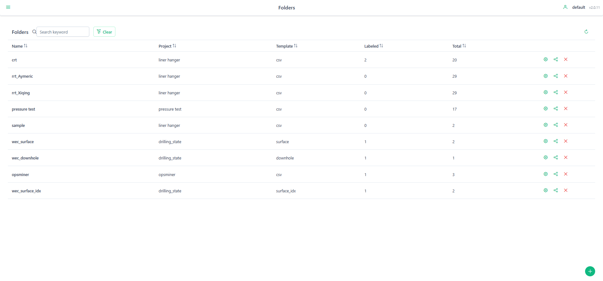

2. Click **"Create New Folder"** button

3. In the folder creation dialog, enter:
   - **Folder Name**: Descriptive name for this collection of files
   - **Project**: Select the project this folder belongs to (dropdown)
   - **Template**: Select the parsing template to use for files in this folder (dropdown)

4. Click **"Create"** to save
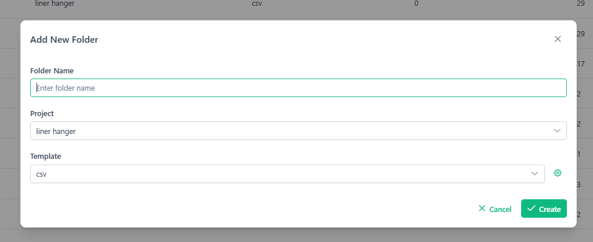

### Main Buttons on Folders Page
- **Create New Folder**: Create a new folder
- **Open Folder**: Click on a folder row to view its files
- **Edit Folder** (pencil icon): Modify folder name, project, or template
- **Delete Folder** (trash icon): Remove folder and its file references
- **Share Folder**: Share with team members
- **Filter by Project**: Dropdown to filter folders by project

### Folder Information Display
Each folder row shows:
- Folder name
- Associated project name
- Associated template name
- Progress: Number of labeled files / Total files
- Last update timestamp

---

## Step 5: Upload Files

After creating a folder, you can upload CSV or Excel files for labeling.

### How to Upload Files

1. From the **Folders** page, click on a folder to open it

2. You'll be taken to the **Files** page for that folder
   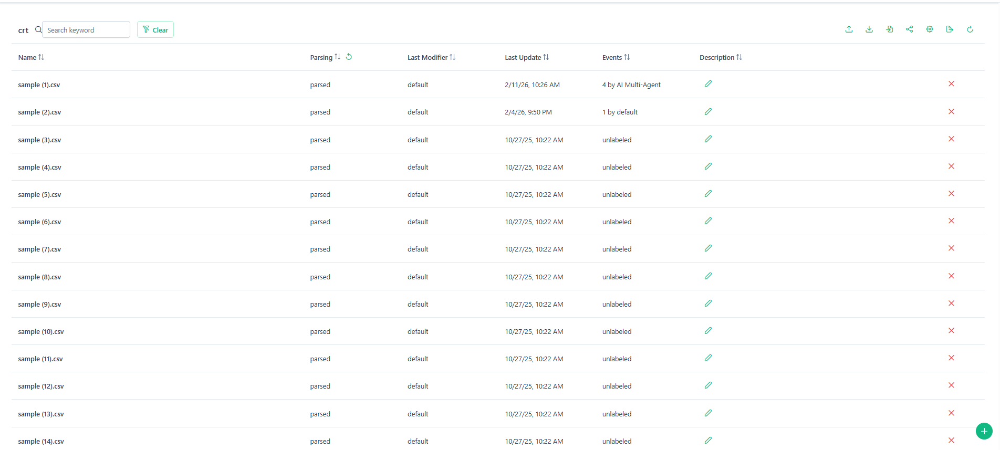

3. Click the **"Upload Files"** button

4. In the upload dialog:
   - **Drag and drop** files into the upload area, OR
   - Click **"Browse"** to select files from your computer
   - You can upload multiple files at once

5. Click **"Upload"** to start the process
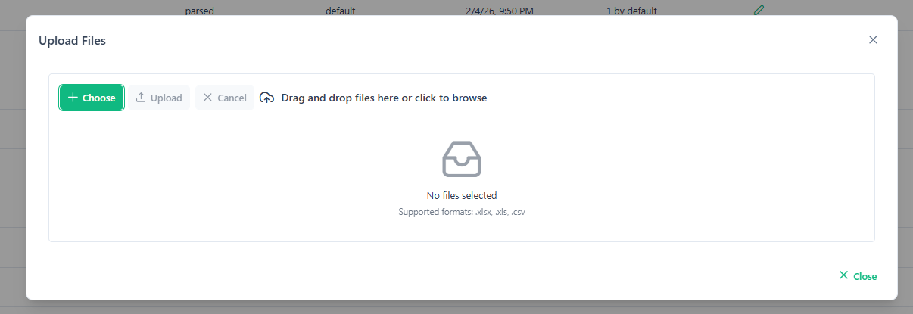

### Upload Process

- Files are uploaded with a progress indicator
- After upload, files are automatically parsed in the background using the folder's template
- Parsing status is displayed for each file:
  - **"Processing"**: File is being parsed
  - **"Parsed"**: File is ready for labeling
  - **"Failed"**: Parsing error occurred

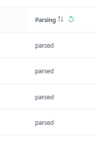

### Main Buttons on Files Page
- **Upload Files**: Open file upload dialog
- **Open File**: Click on a file row to open in labeling interface
- **Delete File** (trash icon): Remove file from folder
- **Search/Filter**: Search box to filter files by name
- **Edit Description**: Add or modify file description
- **Back to Folders**: Return to folders list

### File Information Display
Each file row shows:
- File name
- Parsing status
- Number of events labeled
- File description
- Last update timestamp
- Last modifier username

---

## Step 6: Open a File

Once a file is parsed, you can open it for labeling.

### How to Open a File

1. From the **Files** page, locate the file you want to label

2. Ensure the file status shows **"Parsed"** (not "Processing" or "Failed")

3. Click on the file row to open it

4. The **Labeling** page will load with:
   - Interactive time-series chart at the top
   - Events panel and Guidelines panel below (or in tabs)
   - Toolbar with labeling actions
   - Optional AI chat panel

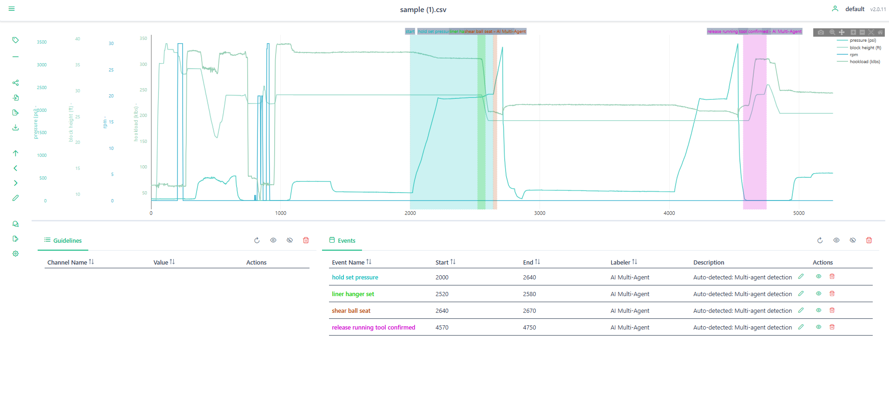

### Main Components of the Labeling Page

#### Chart Area
- Displays all channels as line plots
- X-axis shows time or numeric index
- Y-axis shows measurement values
- Labeled events appear as colored rectangles
- Guidelines appear as horizontal lines

#### Toolbar (Top)
- **Back**: Return to files list
- **Previous File**: Navigate to previous file in folder
- **Next File**: Navigate to next file in folder
- **Label Mode** (button): Enable event labeling mode
- **Guideline Mode** (button): Enable guideline creation mode
- **Share Folder**: Share current folder with others
- **Import Labels**: Upload existing labels from JSON file
- **Export Labels**: Download current labels as JSON
- **Export Data**: Download parsed chart data
- **Edit Classes**: Modify event class descriptions
- **Auto-Detection**: Start AI-powered event detection
- **AI Chat**: Toggle AI chat assistant panel
- **File Description**: Edit description for current file

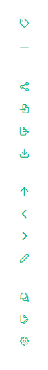

#### Events Panel
- **Table** showing all labeled events with:
  - Class name and color
  - Start and end times
  - Description
  - Labeler username
  - Visibility toggle (eye icon)
  - Delete button (trash icon)
  - Edit description button (pencil icon)

- **Bulk Actions**:
  - **Show All**: Make all events visible
  - **Hide All**: Hide all events from chart
  - **Remove All**: Delete all events (with confirmation)

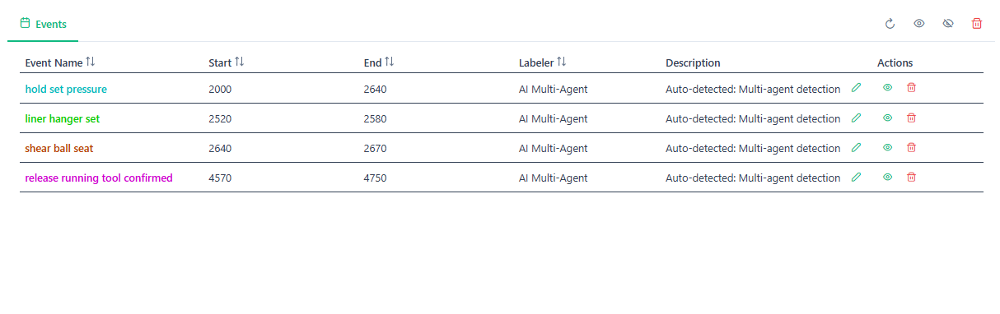

#### Guidelines Panel
- **Table** showing all guidelines with:
  - Channel name
  - Y-value
  - Color
  - Visibility toggle
  - Delete button

- **Bulk Actions**:
  - **Show All**: Make all guidelines visible
  - **Hide All**: Hide all guidelines
  - **Remove All**: Delete all guidelines

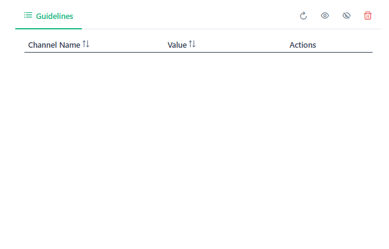

---

## Step 7: Create Events (Labeling)

This is the core labeling workflow where you annotate time ranges with event classes.

### Label Mode: Creating Events

1. Click the **"Label Mode"** button in the toolbar (or press `E` key)
   - The button should highlight to indicate label mode is active

2. Click on the chart at the **start time** of the event
   - A vertical line may appear to show your selection

3. Click on the chart at the **end time** of the event
   - This defines the time range for the event

4. The **Event Creation Dialog** will appear with:
   - **Class Selector**: Dropdown or list of available event classes
   - **Create New Class**: Button to create a class on-the-fly
   - **Description** (optional): Text area for event-specific notes
   - **Color Preview**: Shows the selected class color

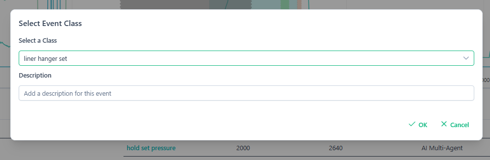

5. Select an event class from the list, OR create a new class if needed

6. Optionally add a description for this specific event instance

7. Click **"Save"** or **"Add Event"** to create the labeled event

8. The event will appear as a colored rectangle on the chart

9. The event will also appear in the Events panel below

### Creating a New Class On-the-Fly

If you discover a new event type while labeling:

1. In the Event Creation Dialog, click **"Create New Class"**

2. Enter:
   - Class name
   - Description (optional)
   - Color (auto-generated or custom)

3. The new class is added to your project and immediately available

### Guideline Mode: Creating Reference Lines

Guidelines are horizontal reference lines that mark thresholds or important values.

1. Click the **"Guideline Mode"** button in the toolbar (or press `G` key)

2. Select the **channel** from the dropdown (which data series to add the guideline to)

3. Click on the chart at the desired **Y-value**
   - The click location determines the guideline's value

4. A horizontal line will appear on the selected channel

5. The guideline will appear in the Guidelines panel

### Editing Events

To modify an existing event:

1. In the Events panel, click the **Edit** (pencil icon) next to the event

2. Update the description in the dialog

3. Click **"Save"**

To delete an event:
- Click the **Delete** (trash icon) next to the event in the Events panel
- Confirm deletion if prompted

### Chart Interactions

- **Zoom**: Click and drag on the chart to zoom into a region
- **Pan**: Click and drag while zoomed in to move the viewport
- **Reset View**: Double-click the chart to reset zoom
- **Click Event**: Click on an event in the Events panel to zoom the chart to that event's time range

### Auto-Save

All labels and guidelines are automatically saved to the database as you create them. No manual save action is required.

---

## Step 8: Navigate Between Files

After labeling a file, you can efficiently move to the next file without returning to the files list.

### Navigation Options

#### Using Toolbar Buttons

1. **Next File** button: Click to move to the next file in the folder
   - If you're on the last file, this button will be disabled

2. **Previous File** button: Click to return to the previous file
   - If you're on the first file, this button will be disabled

3. **Back** button: Return to the files list page

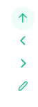

#### Sequential Workflow

The typical workflow is:
1. Open first file
2. Label events and create guidelines
3. Click **"Next File"**
4. Repeat for all files in folder
5. Click **"Back"** when done

### File Navigation Behavior

When navigating between files:
- Current labels are auto-saved
- Chart resets to full view
- New file data loads
- Events and guidelines for the new file are displayed
- File description updates in toolbar

---

## Advanced Features

### AI-Powered Auto-Detection

The auto-detection feature uses AI to automatically identify and suggest event labels.

#### How to Use Auto-Detection

1. Open a file in the labeling interface

2. Click the **"Auto-Detection"** button in the toolbar

3. The **Auto-Detection Panel** will open, showing:
   - **Start Detection** button
   - **Stop Detection** button
   - **Progress indicator**
   - **Reasoning logs** (live updates)
   - **Detected events count**

4. Click **"Start Detection"**

5. The AI will:
   - Analyze the time-series data
   - Generate a detection plan
   - Identify potential events
   - Validate findings
   - Add suggested events to your labels

6. Review the detected events in the Events panel

7. Edit or delete any incorrect suggestions

8. Click **"Stop Detection"** to cancel if needed

#### Auto-Detection Process Stages
- **Planning**: AI analyzes data patterns and creates detection strategy
- **Identifying**: AI finds potential event candidates
- **Validating**: AI verifies and refines detections
- **Complete**: Detected events added to labels

### AI Chat Assistant

The AI Chat provides natural language interaction for data analysis.

#### How to Use AI Chat

1. Click the **"AI Chat"** button in the toolbar to open the chat panel

2. The chat interface includes:
   - **Conversation history** (scrollable)
   - **Message input box**
   - **Send button**
   - **Clear Chat** button

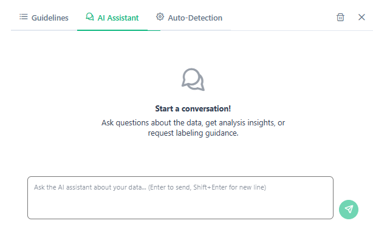

3. Type questions or requests, such as:
   - "What patterns do you see in channel 1?"
   - "Are there any anomalies between 10:00 and 11:00?"
   - "Suggest event labels for this file"
   - "What's the average value of Temperature channel?"

4. Press **Enter** or click **"Send"**

5. The AI will analyze the data and respond with insights

6. Responses may include:
   - Pattern descriptions
   - Suggested labels
   - Statistical analysis
   - Recommendations for guidelines

### Importing Labels

To import labels from a previously exported JSON file:

1. Click **"Import Labels"** in the toolbar

2. In the dialog:
   - Click **"Browse"** or drag and drop a JSON file
   - Preview the labels to be imported

3. Click **"Import"**

4. Confirm that existing labels will be replaced

5. Imported labels appear in the Events panel

### Exporting Labels

To export labels for backup or sharing:

1. Click **"Export Labels"** in the toolbar

2. Select export format (typically JSON)

3. Click **"Download"**

4. Save the file to your computer

The exported file contains all events and guidelines for the current file.

### Exporting Chart Data

To export the parsed time-series data:

1. Click **"Export Data"** in the toolbar

2. Choose format:
   - **JSON**: All channels with timestamps/indices
   - **CSV**: Tabular format

3. Click **"Download"**

### Sharing Folders and Projects

To collaborate with team members:

1. Click **"Share Folder"** or **"Share Project"** button

2. In the sharing dialog:
   - Enter usernames or email addresses
   - Set permissions (view, edit, admin)

3. Click **"Share"**

4. Team members will receive notifications and access

---

## Keyboard Shortcuts

- **E**: Toggle Label Mode
- **G**: Toggle Guideline Mode
- **Enter** (in AI Chat): Send message
- **Ctrl/Cmd + Z**: Undo (in some contexts)
- **Ctrl/Cmd + S**: Manual save (auto-save is default)

---

## Tips and Best Practices

### Template Creation
- Always test templates with sample files before uploading large batches
- Use descriptive regex patterns to ensure correct column matching
- Mark critical channels as "mandatory" to catch parsing errors early

### Event Labeling
- Create detailed class descriptions to help with AI auto-detection
- Use consistent naming conventions for event classes
- Add event-specific descriptions for unusual or ambiguous cases
- Regularly export labels as backups

### File Organization
- Group related files in the same folder
- Use descriptive folder names (e.g., "Machine_A_January_2024")
- Keep folder size manageable (50-200 files per folder recommended)

### AI Features
- Provide detailed class descriptions to improve auto-detection accuracy
- Review all AI-suggested labels before finalizing
- Use AI Chat to understand complex patterns before labeling

### Performance
- For very large files (>100MB), the system automatically resamples data to 5,000 points per channel for visualization
- All original data is preserved; resampling only affects display
- Close unused tabs/panels to improve browser performance

### Collaboration
- Add file descriptions to provide context for team members
- Use consistent event class definitions across the project
- Regularly sync with team to avoid duplicate labeling efforts

---

## Troubleshooting

### File Won't Parse
- Verify the template matches the file structure
- Check that column names match the regex patterns
- Ensure header row and skip row settings are correct
- Try uploading a different file to isolate the issue

### Chart Not Loading
- Ensure file status is "Parsed" (not "Processing")
- Refresh the browser page
- Check browser console for errors
- Verify file size is supported

### Labels Not Saving
- Check internet connection
- Ensure you have edit permissions for the folder
- Verify you're logged in
- Try refreshing and re-creating the label

### Auto-Detection Not Working
- Ensure class descriptions are detailed and accurate
- Verify file has valid data in all channels
- Check that WebSocket connection is active (status indicator)
- Try stopping and restarting the detection

---

## Support and Feedback

For additional help or to report issues:
- Navigate to the **Contact** page in the application
- Email support (if provided)
- Check the **Help** or **Manual** page for updates

---

**Version**: 1.0
**Last Updated**: February 2026

